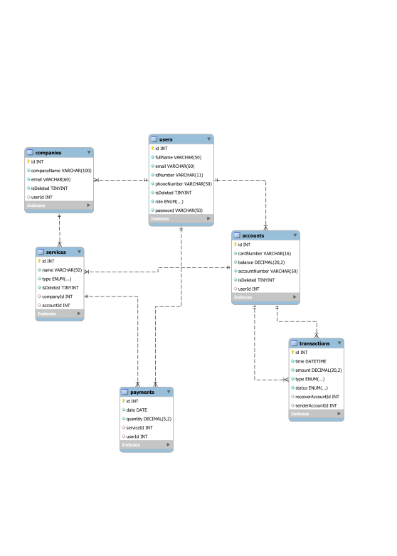

<p align="center">
  <a href="http://nestjs.com/" target="blank"></a>
</p>

[circleci-image]: https://img.shields.io/circleci/build/github/nestjs/nest/master?token=abc123def456
[circleci-url]: https://circleci.com/gh/nestjs/nest

  <p align="center">A progressive <a href="http://nodejs.org" target="_blank">Node.js</a> framework for building efficient and scalable server-side applications.</p>
    <p align="center">
<a href="https://www.npmjs.com/~nestjscore" target="_blank"></a>
<a href="https://www.npmjs.com/~nestjscore" target="_blank"></a>
<a href="https://www.npmjs.com/~nestjscore" target="_blank"></a>
<a href="https://circleci.com/gh/nestjs/nest" target="_blank"></a>
<a href="https://coveralls.io/github/nestjs/nest?branch=master" target="_blank"></a>
<a href="https://discord.gg/G7Qnnhy" target="_blank"></a>
<a href="https://opencollective.com/nest#backer" target="_blank"></a>
<a href="https://opencollective.com/nest#sponsor" target="_blank"></a>
  <a href="https://paypal.me/kamilmysliwiec" target="_blank"></a>
    <a href="https://opencollective.com/nest#sponsor"  target="_blank"></a>
  <a href="https://twitter.com/nestframework" target="_blank"></a>
</p>
  <!--[](https://opencollective.com/nest#backer)
  [](https://opencollective.com/nest#sponsor)-->

## Databse Schemas



## User’s APIs

```js

@Role.operator
@Post/api/v1/users/registration
{
  fullName: string,
  phoneNumber: string,
  email: string,
  idNumber: number,

}

@Role.operator
@Get/api/v1/users/
{
	// sort
	// searchBy
	// pagination
}

@Get/api/v1/users/
{
  // where userRole = user
  // searchBy idNumber

}  ?


@Patch/api/v1/users/userId
{
  //to update properties
  //Is not allowed to change idNumber and current accountNumber
}

@Role.operator
@Delete/api/v1/users/userId
{
	//to deactivate account, isDeleted = true;
}


```

## Companies’ API List

```js

@Role.operator
@Post/api/v1/companies/registration
{
  name: string,
  phoneNumber:string,
  email: string,
  userId:number,


}


@Get/api/v1/companies/
{

// get all companies
// sort
// searchBy
// pagination


}


@Get/api/v1/companies/
{
  //findCompanyById ( we get id from req)
}


@Patch/api/v1/companies/
{
  // we get companyId from jwt token
  //to update properties
  //Company representative is not allowed to change current accountNumber

}
@Role.Operator
@Delete/api/v1/companies/
{
  // we get companyId from jwt token
  //to deactivate account, deleted = true;
}


```

## Service’s API List

```js

@Role.operator
@Post/api/v1/service/
{
  name: string,
  type: enum,
  companyId: string,
  accountId: number,
}


@Get/api/v1/services/
{
  //where deleted === false
  // sort
  // searchBy
  // pagination

     }
}


@Role.operator
@Patch/api/v1/service/:serviceId
{

	//to update properties


}


@Role.operator
@Delete/api/v1/service/:serviceId
{

	//to delete service, deleted = true;
}

```

## Accounts’ API List

```js

@Role.operator
@Post/api/v1/accounts/
{
  userId:number
  accountNumber: string,
  cardNumber: number,
  balance: number,

}


@Role.operator
@Get/api/v1/accounts/
{
  //where deleted === false
  // sort
  // searchBy
  // pagination


}

@Get/api/v1/accounts/id
{
   //get account by id
}


@Role.operator
@Delete/api/v1/account/:accountId
{

	//to delete existing account, deleted = true;
}

```

## Transactions’ API List

```js

@Post/api/v1/transactions/ -
{
  senderAccount: (number),
  receiverAccount: (number),
  amount: number,
  date: Date,
  status: enum,// if amount > 10000{pending} else {recieved}
  type: enum,

}

@Role.operator
@Patch/api/v1/transactions/
{
//update status accordingly
//can cancel transaction if status = pending
}

@Role.operator
@Get/api/v1/transactions
{

  //where deleted === false
  // sort
  // searchBy
  // pagination

}


@Get/api/v1/transactions/userId
{
  // get all transaction by userId

}
```

## Description

[Nest](https://github.com/nestjs/nest) framework TypeScript starter repository.

## Installation

```bash
$ npm install
```

## Running the app

```bash
# development
$ npm run start

# watch mode
$ npm run start:dev

# production mode
$ npm run start:prod
```

## Test

```bash
# unit tests
$ npm run test

# e2e tests
$ npm run test:e2e

# test coverage
$ npm run test:cov
```

## Support

Nest is an MIT-licensed open source project. It can grow thanks to the sponsors and support by the amazing backers. If you'd like to join them, please [read more here](https://docs.nestjs.com/support).

## Stay in touch

- Author - [Kamil Myśliwiec](https://kamilmysliwiec.com)
- Website - [https://nestjs.com](https://nestjs.com/)
- Twitter - [@nestframework](https://twitter.com/nestframework)

## License

Nest is [MIT licensed](LICENSE).
